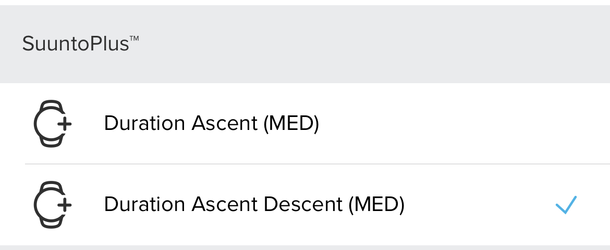
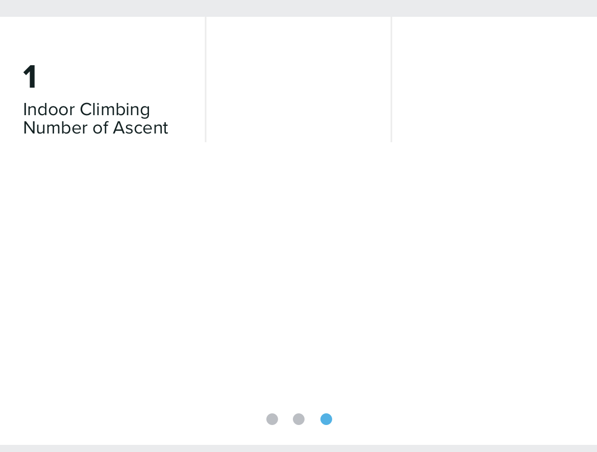

# Suunto App Template
Suunto App Template 1.0 Version

This template is intended for five fields on the clock screen. One field in the SA Outputs and another field in the SA Summary Outputs. 

### Screen Design:
    

 
 
### SA Outputs Example:
  #### Suunto Plus Metrics to analize later in SA
  
    
   
  #### SA Summary Outputs Example
  
       
   
---
### :fire: My Stats :

